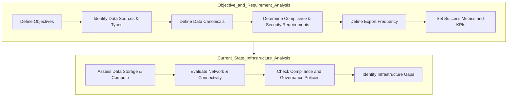

# Financial-Institution-Assessment-Plan

Let's expand in detail on the **"Objective and Requirement Analysis"** and **"Current State Infrastructure Analysis"** for a continuous data export solution from on-premises to Azure for a financial banking use case.

---

### **1. Objective and Requirement Analysis**

In the context of a financial banking organization, moving data continuously to Azure enables advanced analytics, real-time fraud detection, compliance reporting, and archival. Defining objectives and requirements is essential to align the export solution with the bank's operational, regulatory, and security needs.

#### **Objective and Use Case Definition**

- **Objective**: Enable secure, real-time or near real-time data export from on-premises systems (e.g., transactional systems, customer databases) to Azure for processing and analytics.
- **Use Case**: 
  - A financial institution wants to analyze customer transactions in real time to detect suspicious patterns indicative of fraud.
  - The bank requires compliance reporting to meet regulatory standards (e.g., PCI-DSS, AML).
  - For this, continuous data export from on-premises transactional databases to Azure Data Lake and Synapse Analytics will allow real-time analytics, triggering alerts when anomalies are detected.
  - This solution will also support machine learning models in Azure to predict potential fraudulent activities.

#### **Requirement Analysis**

- **Data Sources and Types**:
  - **On-premises Core Banking System**: Stores transactional data such as deposits, withdrawals, fund transfers, loan payments, etc.
  - **Customer Database**: Includes customer demographic and account information, requiring sensitive handling.
  - **Log Files**: System and application logs for operational monitoring and security audits.
  
- **Data Export Frequency**:
  - Real-time or near real-time export is critical for fraud detection to minimize potential losses.
  - Scheduled batch exports may be used for lower-priority, non-transactional data, such as periodic account summaries.

- **Data Canonicals**:
  - Define standard schemas (canonical models) for transactional and customer data to ensure consistency.
  - Transactional data will follow a standard model with fields for timestamp, transaction ID, amount, account number, and transaction type.
  - Canonicals will include metadata standards for source, format, and data sensitivity.

- **Compliance and Security Requirements**:
  - Ensure compliance with PCI-DSS for cardholder data and Anti-Money Laundering (AML) regulations.
  - Apply encryption at rest and in transit, data masking for sensitive fields, and enforce strict access control.
  - Implement logging and auditing to track data access and transformations.

#### **Success Metrics and KPIs**

- **Latency**: Minimal delay in data availability in Azure to enable near-real-time analysis.
- **Accuracy**: Data accuracy and integrity post-transformation, measured against canonical schema validations.
- **Compliance**: Adherence to PCI-DSS and AML standards verified through periodic audits.
- **Scalability**: Ability to handle increasing data volume and transactional throughput.

---

### **2. Current State Infrastructure Analysis**

In this phase, we assess the existing on-premises infrastructure, identify gaps, and determine what adjustments are needed for data export to Azure.

#### **On-Premises Infrastructure Assessment**

- **Data Storage and Compute**:
  - Evaluate the core banking system’s database architecture (e.g., Oracle, SQL Server) and capacity. Assess compute resources to ensure the system can handle both ongoing operations and additional load for data extraction.
  - Determine if ETL/ELT tools are available on-premises, or if custom data extractors are needed for the continuous export.

- **Network and Connectivity**:
  - Assess the network bandwidth and latency for data transfer to Azure.
  - Check if VPN or ExpressRoute connectivity is established with Azure for a secure and reliable connection.
  - Identify potential bottlenecks, such as firewalls or proxy servers, that could affect data transfer speed.

- **Data Governance and Compliance**:
  - Review existing data governance policies for on-premises data, ensuring they align with Azure policies.
  - Verify data handling protocols (e.g., data masking, encryption) are in place to ensure data exported to Azure complies with banking regulations.

#### **Infrastructure Gaps and Optimization Needs**

- **Scalability**: Evaluate if current on-premises systems can scale to handle continuous data extraction without impacting regular banking operations.
- **Compliance**: Identify any security gaps (e.g., encryption standards, access control policies) that need to be addressed to meet Azure’s compliance requirements.
- **Monitoring**: Review existing monitoring tools to ensure they support logging, auditing, and alerting for data export activities.

### **Mermaid Diagram for Objective and Current State Analysis**

Here’s a mermaid diagram representing the **Objective and Requirement Analysis** and **Current State Infrastructure Analysis** processes for a financial banking use case:

This diagram summarizes the flow between defining objectives, understanding data requirements, and assessing the current infrastructure’s capability to support continuous data export to Azure, with a focus on the specific needs of a financial banking organization.

