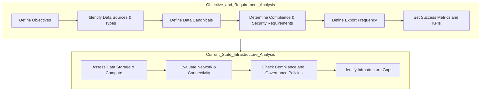
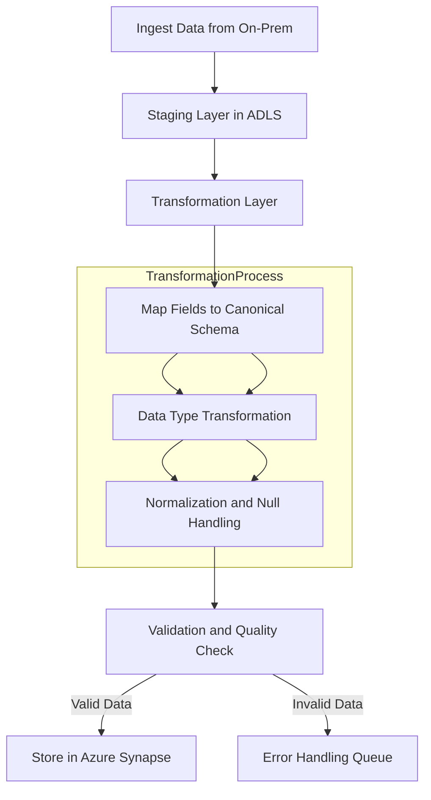

# Financial-Institution-Assessment-Plan

---

### **1. Objective and Requirement Analysis**

In the context of a financial banking organization, moving data continuously to Azure enables advanced analytics, real-time fraud detection, compliance reporting, and archival. Defining objectives and requirements is essential to align the export solution with the bank's operational, regulatory, and security needs.

#### **Objective and Use Case Definition**

- **Objective**: Enable secure, real-time or near real-time data export from on-premises systems (e.g., transactional systems, customer databases) to Azure for processing and analytics.
- **Use Case**: 
  - A financial institution wants to analyze customer transactions in real time to detect suspicious patterns indicative of fraud.
  - The bank requires compliance reporting to meet regulatory standards (e.g., PCI-DSS, AML).
  - For this, continuous data export from on-premises transactional databases to Azure Data Lake and Synapse Analytics will allow real-time analytics, triggering alerts when anomalies are detected.
  - This solution will also support machine learning models in Azure to predict potential fraudulent activities.

#### **Requirement Analysis**

- **Data Sources and Types**:
  - **On-premises Core Banking System**: Stores transactional data such as deposits, withdrawals, fund transfers, loan payments, etc.
  - **Customer Database**: Includes customer demographic and account information, requiring sensitive handling.
  - **Log Files**: System and application logs for operational monitoring and security audits.
  
- **Data Export Frequency**:
  - Real-time or near real-time export is critical for fraud detection to minimize potential losses.
  - Scheduled batch exports may be used for lower-priority, non-transactional data, such as periodic account summaries.

- **Data Canonicals**:
  - Define standard schemas (canonical models) for transactional and customer data to ensure consistency.
  - Transactional data will follow a standard model with fields for timestamp, transaction ID, amount, account number, and transaction type.
  - Canonicals will include metadata standards for source, format, and data sensitivity.

- **Compliance and Security Requirements**:
  - Ensure compliance with PCI-DSS for cardholder data and Anti-Money Laundering (AML) regulations.
  - Apply encryption at rest and in transit, data masking for sensitive fields, and enforce strict access control.
  - Implement logging and auditing to track data access and transformations.

#### **Success Metrics and KPIs**

- **Latency**: Minimal delay in data availability in Azure to enable near-real-time analysis.
- **Accuracy**: Data accuracy and integrity post-transformation, measured against canonical schema validations.
- **Compliance**: Adherence to PCI-DSS and AML standards verified through periodic audits.
- **Scalability**: Ability to handle increasing data volume and transactional throughput.

---

### **2. Current State Infrastructure Analysis**

In this phase, we assess the existing on-premises infrastructure, identify gaps, and determine what adjustments are needed for data export to Azure.

#### **On-Premises Infrastructure Assessment**

- **Data Storage and Compute**:
  - Evaluate the core banking system’s database architecture (e.g., Oracle, SQL Server) and capacity. Assess compute resources to ensure the system can handle both ongoing operations and additional load for data extraction.
  - Determine if ETL/ELT tools are available on-premises, or if custom data extractors are needed for the continuous export.

- **Network and Connectivity**:
  - Assess the network bandwidth and latency for data transfer to Azure.
  - Check if VPN or ExpressRoute connectivity is established with Azure for a secure and reliable connection.
  - Identify potential bottlenecks, such as firewalls or proxy servers, that could affect data transfer speed.

- **Data Governance and Compliance**:
  - Review existing data governance policies for on-premises data, ensuring they align with Azure policies.
  - Verify data handling protocols (e.g., data masking, encryption) are in place to ensure data exported to Azure complies with banking regulations.

#### **Infrastructure Gaps and Optimization Needs**

- **Scalability**: Evaluate if current on-premises systems can scale to handle continuous data extraction without impacting regular banking operations.
- **Compliance**: Identify any security gaps (e.g., encryption standards, access control policies) that need to be addressed to meet Azure’s compliance requirements.
- **Monitoring**: Review existing monitoring tools to ensure they support logging, auditing, and alerting for data export activities.

### **Mermaid Diagram for Objective and Current State Analysis**

Here’s a mermaid diagram representing the **Objective and Requirement Analysis** and **Current State Infrastructure Analysis** processes for a financial banking use case:

Expanding on **Data Transformation and Canonical Mapping** is critical for creating a consistent, reliable, and high-quality data export pipeline from on-premises systems to Azure, especially in financial services. This process ensures data standardization, accuracy, and usability for advanced analytics and reporting in Azure.

---

### **Overview of Data Transformation and Canonical Mapping**

In a continuous data export scenario, data from diverse on-premises sources (such as transactional systems, customer databases, and logs) must be transformed to fit a standardized or canonical format before reaching Azure. Canonical mapping enforces consistent data schemas, enabling interoperability across systems, simplifying data management, and facilitating downstream analytics.

### **Key Components of Data Transformation and Canonical Mapping**

1. **Canonical Schema Definition**
   - **Purpose**: A canonical schema is a standardized model that defines the structure, format, and semantics of data fields across different systems. This schema ensures data consistency, simplifies integration, and improves data quality.
   - **Schema Definition**: 
      - Create canonical models based on each data type, such as transactions, customer records, or audit logs.
      - Define field names, data types, relationships, and validation rules for each model.
      - Incorporate metadata fields (e.g., source system, ingestion timestamp, and processing status) to provide additional context.
   - **Financial Services Example**:
      - **Transaction Data Model**: Standard fields might include `TransactionID`, `AccountNumber`, `Amount`, `Timestamp`, `TransactionType`, `Currency`, `Location`, and `MerchantID`.

2. **Schema Mapping and Data Transformation**
   - **Field Mapping**: Map each source field from the on-prem system to its corresponding canonical field in Azure.
      - Example: In a customer database, map `Cust_ID` (source) to `CustomerID` (canonical).
      - Ensure that source fields that don’t have a direct match in the canonical model are appropriately handled (e.g., by creating custom fields or excluding them).
   - **Data Type Transformation**:
      - Convert data types as necessary to meet the canonical model requirements.
      - Example: Convert `Amount` from `String` to `Decimal` if required by the canonical schema in Azure.
   - **Data Normalization**:
      - Standardize data formats across sources. For example, ensure all dates follow `YYYY-MM-DD` format.
      - Apply currency conversions or unit standardization where necessary.
   - **Null Handling**:
      - Define null-handling rules, such as replacing null values with defaults or placeholders (e.g., `N/A` for missing `MerchantID`).

3. **Data Quality Rules and Validation**
   - **Field-Level Validation**: Check each field against canonical rules (e.g., `TransactionID` should be unique, `Amount` should be positive).
   - **Data Consistency Rules**:
      - Validate that records conform to the defined schema structure. For example, `TransactionType` might only accept specific values (`Deposit`, `Withdrawal`, `Transfer`).
   - **Error Handling**:
      - Log and handle records that fail validation. Errors can be routed to a dead-letter queue or an error handling process for later review.

4. **Transformation Logic for Specific Use Cases**
   - **Real-Time Fraud Detection**:
      - Transform data to canonical models on ingestion, making it analytics-ready.
      - Apply custom logic to identify anomalies in transaction patterns.
   - **Compliance and Regulatory Reporting**:
      - Define transformations to align with regulatory requirements (e.g., data masking on sensitive fields).
      - Ensure data is formatted for easy extraction to reporting tools (e.g., Power BI, Synapse Analytics).

### **Data Transformation Pipeline Architecture**

In Azure, tools like **Azure Data Factory (ADF)**, **Azure Synapse Pipelines**, or **Databricks** are typically used for data transformation and canonical mapping. Here’s a breakdown of a typical pipeline for a financial services use case:

1. **Data Ingestion Layer**:
   - Data from on-premises sources is ingested in raw format into **Azure Data Lake Storage (ADLS)**.
   - Use ADF or Synapse Pipelines to orchestrate the ingestion and initial staging of data.
   
2. **Staging and Transformation Layer**:
   - In the staging layer, raw data is temporarily stored before transformation.
   - Use transformation activities in ADF, Synapse, or Databricks to map source fields to canonical fields, standardize formats, and enforce validation rules.

3. **Validation and Quality Check Layer**:
   - Validate transformed data against canonical schema requirements.
   - Route any invalid data to a dead-letter queue or error-handling pipeline.

4. **Final Data Storage and Analytics Layer**:
   - Store transformed data in **Azure Synapse** or **Azure SQL Database** for easy access by analytics and reporting tools.
   - This data is now in canonical form, making it compatible with advanced analytics, machine learning, and reporting.

### **Detailed Data Transformation Workflow**

This workflow ensures data exported from on-premises systems to Azure is fully transformed and standardized into the canonical model, ready for analytics and machine learning.

### **Example Canonical Mapping in Financial Services**

Consider a bank’s transactional data that needs canonical mapping from the source schema to a target schema in Azure.

#### **Source Schema**:
- **`Trans_ID`**: Unique ID of the transaction.
- **`Acc_Num`**: Customer’s account number.
- **`Trx_Amt`**: Transaction amount in cents.
- **`Trans_Date`**: Date of transaction in `MM-DD-YYYY`.
- **`Trans_Type`**: Type of transaction (`W`, `D`, `T` for Withdrawal, Deposit, Transfer).

#### **Canonical Schema**:
- **`TransactionID`**: String, mapped directly from `Trans_ID`.
- **`AccountNumber`**: String, mapped from `Acc_Num`.
- **`Amount`**: Decimal, converted from `Trx_Amt` (divided by 100 to convert cents to dollars).
- **`Timestamp`**: Standardized to `YYYY-MM-DD` from `Trans_Date`.
- **`TransactionType`**: Expanded values (`W` -> `Withdrawal`, `D` -> `Deposit`, `T` -> `Transfer`).

#### **Transformation Steps**:
1. **Field Mapping**: Map `Trans_ID` to `TransactionID`, `Acc_Num` to `AccountNumber`, etc.
2. **Data Type Conversion**: Convert `Trx_Amt` from cents (integer) to dollars (decimal).
3. **Date Standardization**: Convert `Trans_Date` to `Timestamp` in `YYYY-MM-DD`.
4. **Code Expansion**: Map codes in `Trans_Type` to descriptive labels.

---

### **Conclusion**

The **Data Transformation and Canonical Mapping** process in Azure for financial services involves defining a canonical schema that standardizes data formats, transforming data to fit this schema, and applying validation and error-handling to ensure data quality. This process allows data to flow from on-premises to Azure in a usable, consistent format, enabling reliable analytics and reporting while meeting financial compliance requirements.

